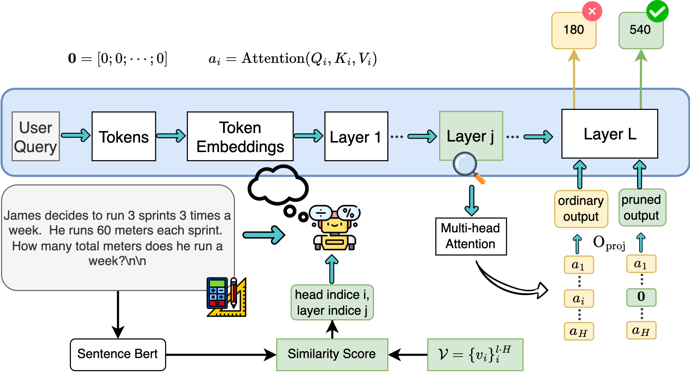

# Official implementation of "Structured Pruning for Diverse Best-of-$N$ Reasoning Optimization" (ACL'25 Short Findings)

<div align="center">
  <a href="https://hieunt91.github.io/" target="_blank">Hieu&nbsp;Trung&nbsp;Nguyen</a> &emsp;
  <a href="https://nguyenngocbaocmt02.github.io/" target="_blank">Bao&nbsp;Nguyen</a> &emsp;
  <a href="https://www.vietanhnguyen.net/" target="_blank">Viet&nbsp;Anh&nbsp;Nguyen</a> &emsp;
  <br> <br>
</div>
<br>

<div align="center">
    
</div>

<!-- 
Details of algorithms and experimental results can be found in [our paper](https://arxiv.org/abs/2405.14352):
```bibtex
@article{bui2024explaining,
  title={Explaining Graph Neural Networks via Structure-aware Interaction Index},
  author={Bui, Ngoc and Nguyen, Hieu Trung and Nguyen, Viet Anh and Ying, Rex},
  booktitle={International Conference on Machine Learning},
  organization={PMLR},
  year={2024}
}
```
Please consider citing this paper if it is helpful for you. -->

## Installation

Requirements:

```sh
python 3.12.9
pip install -e .
```


## Inference
To infer on MATH500 and GSM8K, please run those two scripts
```
./attention_pruning_experiments/scripts/get_accuracy_data_gsm8k.sh
./attention_pruning_experiments/scripts/get_accuracy_data.sh
```

To reproduce our tables (coming soon, we will release our wandb experiments): 
```
python3 attention_pruning_experiments/draw_tables.py
```

## Availability

## Acknowledgement

A substantial portion of the source code has been borrowed from the following repositories:

- https://github.com/QwenLM/Qwen2.5-Math/tree/main
## Contact

If you have any problems, please open an issue in this repository or send an email to [hilljun.2000@gmail.com](mailto:hilljun.2000@gmail.com).